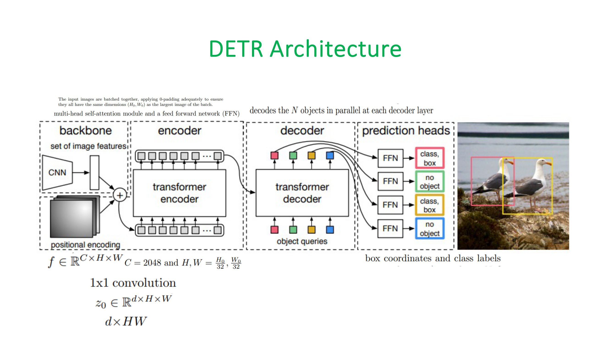

# DETR: Object Detection with Transformers

**contents:**

- [Detection Transformer](./README.md/#DETR)
- [Architecture](./README.md/#architecture)

            1. Backbone
            
            2. DETR TRANSFORMER ENCODER
            
                • POSITIONAL ENCODINGS

            3. DETR TRANSFORMER DECODER

                • OBJECT QUERIES
            
- [Core Concepts](./README.md/#TERMS)
- [Critical Takeaways](./README.md/#POINTS)
- [Assignment](./README.md/#Assignment)
- [DEMO](./README.md/#demo)

<h1 align = 'center',id = "DETR"> 🤗 DETR - Detection Transformer</h1>

The Detection Transformer was developed by the Facebook Research team and introduced in [[1]](http://arxiv.org/abs/1906.05909). DETR works by generating a *set* of features from an input image, and then using a transformer to predict the location (surrounding bounding box) of a predefined number of objects as well as their respective class. 
<h1 id = "architecture">  🧠 DETR Architecture </h1>

**`The overall DETR architecture is simple, and shown below:`**

            

The DETR model consists of a pre-trained CNN backbone, which produces a set of lower-dimensional set of features. These features are then scaled and added to a positional encoding, which is fed into a Transformer consisting of an Encoder and a Decoder. The output of the decoder is then fed into a fixed number of Prediction Heads which consist of a predefined number of feed-forward networks. Each output of one of these prediction heads consists of a class prediction, as well as a predicted bounding box. The loss is calculated by computing the **bipartite matching loss**.

• *It contains three main components:*

        • 1. A CNN backbone (ResNet50) to extract a compact feature representation,
        
        • 2. An encoder-decoder transformer
        
        • 3. A simple feed-forward network that makes the final prediction. 

<h2 align = 'center'> 🪨 Backbone Model </h2>

    Starting from the initial image of size H, W, 3, a ResNet50 model generates a lower resolution activation maps of 
    
    size H/32, W/32, 2048. 
    
    Let us assume 640x640x3 as the image size for our discussions. 

            So, the backbone gives us a 20x20x2048 activation map.

<h2 align = 'center'> 🔄 Transformer Encoder  </h2>

     Firstly, the paper uses a 1x1 convolution operation to reduce the dimension of the input channels from 2048 to 256.

                                    20x20x2048 → 20x20x256

 
      Encoder expects 1D sequential input, hence we collapse the spatial dimensions to 1D:
    
                                   20x20x256 → 400x256

 
      We use 8 heads (in both, the encoder as well as the decoder), so remember internally that we would be working with [400x32]x8.

      From a spatial perspective, this transforms the input from a size of 20x20x2048 to 20x20x256.

      However, because the encoder expects a 1D sequential input, they collapse the spatial dimensions to create a 1D representation. 
      
      This means converting the size from 20x20x256 to 400x256.

      It's worth noting that both the encoder and the decoder utilize 8 heads. Internally, this means that during processing, we're dealing 
      with [400x32]x8, where 400 represents the sequence length and 32 signifies the depth of each head. 
      This configuration is consistent across both components of the model.

<h1 id = "TERMS"> ♻️ Core concepts/terms</h1>

**1. Set prediction problem:** A set prediction problem is a classification problem where each input is associated with a set of labels (rather than a single label). In the context of object detection, consider an image containing multiple objects like a dog, a tree, and a ball. Instead of identifying just one item, the task is to predict and list all of these objects present in the image. 

**2. DEtection TRansformer (DETR):** DETR is a model for solving the set prediction problem which aims to reduce the complexity of the detection pipeline by eliminating hand-designed components like a *non-maximum suppression (NMS)* procedure or anchor generation that explicitly encode prior knowledge about the task. It is based on a transformer encoder-decoder architecture, a set-based global loss to enforce unique predictions, and a fixed set of object queries.

<h1 id = "POINTS">  🙌 Critical Takeaways </h1>

DETR eliminates the need for many components of the detection pipeline that rely on prior knowledge about the task, which simplifies the pipeline. 

DETR is conceptually simple and does not require a specialized library. 

DETR shows accuracy and run-time performance on par with Faster RCNN on the COCO object detection dataset. 

DETR can be generalized to produce panoptic segmentation in a unified manner.

<h1 id = "Assignment">✍️ Assignment</h1>

            

<h1 id = "demo">✍️ DEMO </h1>

https://github.com/VijayPrakashReddy-k/DETR/assets/42317258/599ecf00-04f2-4a40-9fc0-04c63d7f7b4f

